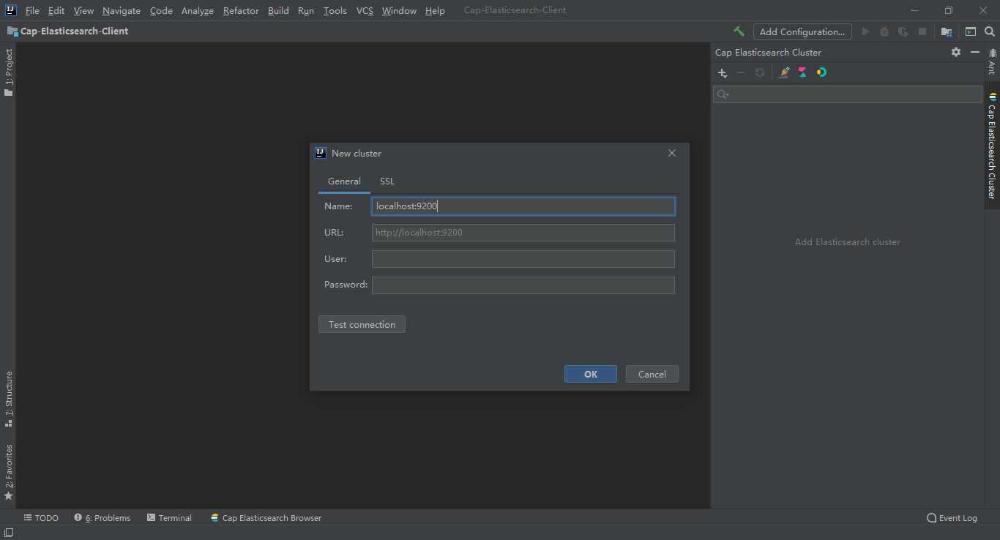
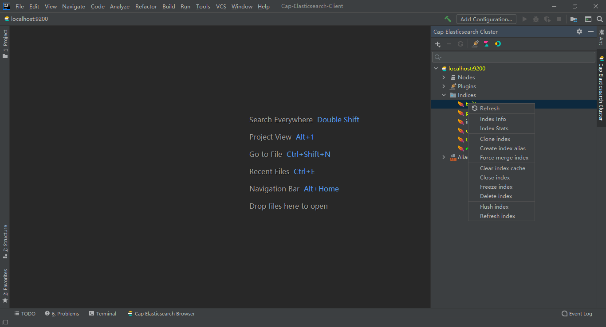
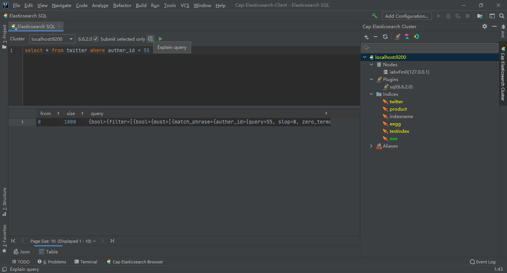
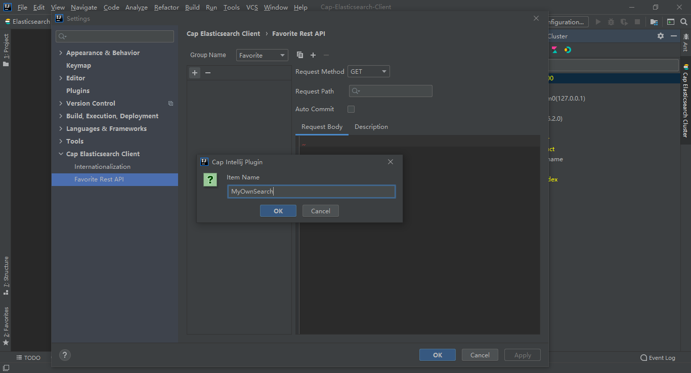
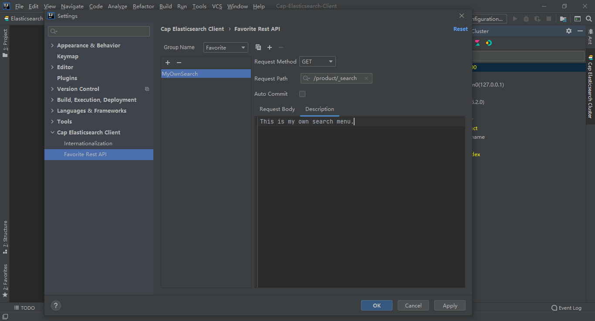
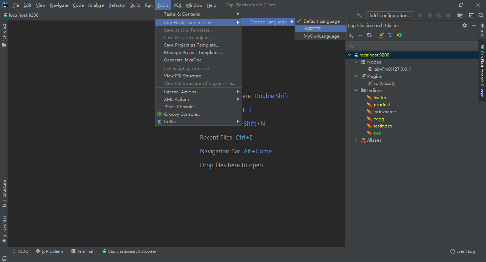

# Cap-Elasticsearch-Client

A IDEA Plugin for Elasticsearch, allows accessing to Elasticsearch cluster, browse and edit your data, execute REST API requests, execute SQL query.

Some code implementations refer to some excellent projects.

For example:

[Elasticsearch](https://plugins.jetbrains.com/plugin/14512-elasticsearch)

[Mongo Plugin](https://plugins.jetbrains.com/plugin/14512-elasticsearch)

Thanks to these projects and their authors!

## How to use

### Install

You can install it through Marketplace, or zip archive.

Then you will see like this:

### Add Cluster

You can add a cluster with two steps:

* click the menu  

* enter the cluster information

Then you can manage your cluster.

### Basic Menu

There are some basic menu items.

* Cluster API

* Nodes API

* Indices API

* Index API

### REST API Query

You can operate your data use rest api for all versions of Elasticsearch.

* `/`

* `_search` View as JSON Tree

* `_search` View as Table

### SQL Query

In addition, you can query your data use SQL for high version Elasticsearch.

If you have installed the [elasticsearch-sql](https://github.com/NLPchina/elasticsearch-sql) plugin, you can execute sql query like this:

It supports explain sql query or execute sql query that supported by [elasticsearch-sql](https://github.com/NLPchina/elasticsearch-sql) plugin.

But, if you have installed the [opendistro-for-elasticsearch](https://github.com/opendistro-for-elasticsearch/sql) plugin, it will support later.

If you use x-pack-sql for sql query, you can execute sql query like this:

All of them supports SQL syntax checking, SQL syntax highlighting and autocomplete.

You can customize your highlight color.

### Simulate Kibana Query

#### DevTools

##### Console

If you like to use kibana dev tools console, you can use it like this:

Enter your request and execute it, you will get the response.

You can enter multiple request, and select which one to execute.

And it support autocomplete.

* Request method autocomplete.

* Request path autocomplete.

* Index autocomplete

You can customize your highlight color.

### Favorite API

As you can see, I only implemented a few simple menu items,  it's not enough. So you can define your own favorite api, it will display as a menu item.

* Enter item name

* Enter API informations

* Then, you will find it as a menu item

* Or use it from editor's toolbar

* It will works

* You can query it

### Internationalization

Two languages are provided by default, but some semantics are not very accurate, you can define your own display language.

* enter your language identification

* enter your message

* choose it

* you will see it

### Other

Other features are on the way...