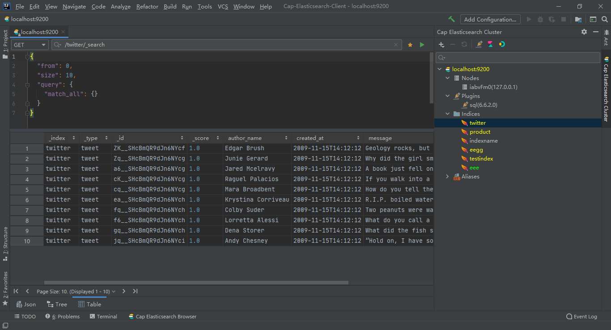
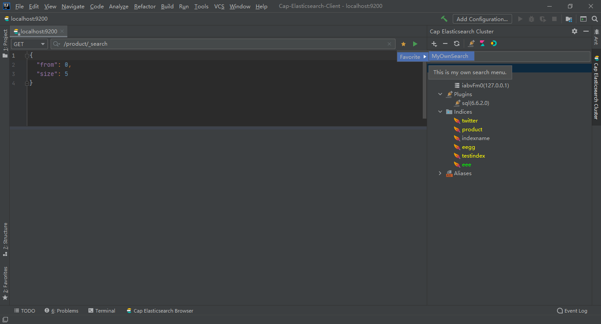
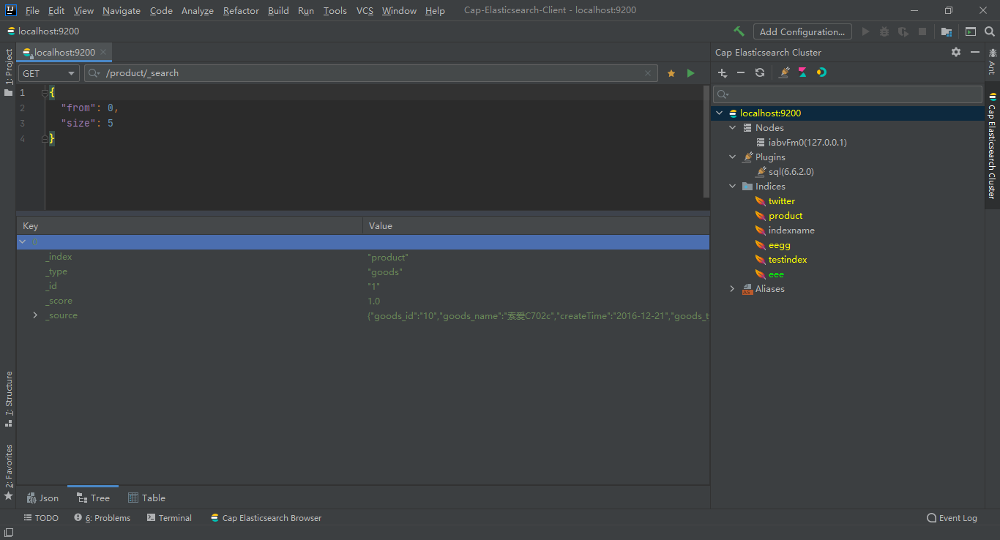

# Cap-Elasticsearch-Client

A IDEA Plugin for Elasticsearch, allows accessing to Elasticsearch cluster, browse and edit your data, execute REST API requests, execute SQL query.

Some code implementations refer to some excellent projects.

For example:

[Elasticsearch](https://plugins.jetbrains.com/plugin/14512-elasticsearch)

[Mongo Plugin](https://plugins.jetbrains.com/plugin/14512-elasticsearch)

Thanks to these projects and their authors!

## How to use

### Install

You can install it through Marketplace, or zip archive.

Then you will see like this:

### Add Cluster

You can add a cluster with two steps:

* click the menu  

* enter the cluster information

Then you can manage your cluster.

### REST API Query

You can operate your data use rest api for all versions of Elasticsearch.

* `/`

* `_search` View as JSON Tree

* `_search` View as Table

### SQL Query

In addition, you can query your data use SQL for high version Elasticsearch.

Now it supports SQL syntax checking and SQL syntax highlighting.

You can customize your highlight color.

### Favorite API

As you can see, I only implemented a few simple menu items,  it's not enough. So you can define your own favorite api, it will display as a menu item.

* Enter item name

* Enter API informations

* Then, you will find it as a menu item

* Or use it from editor's toolbar

* It will works

* You can query it

### Internationalization

Two languages are provided by default, but some semantics are not very accurate, you can define your own display language.

* enter your language identification

* enter your message

* choose it

* you will see it

### Other

Other features are on the way...