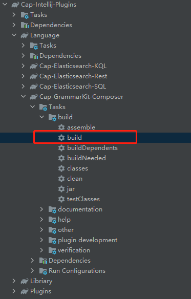
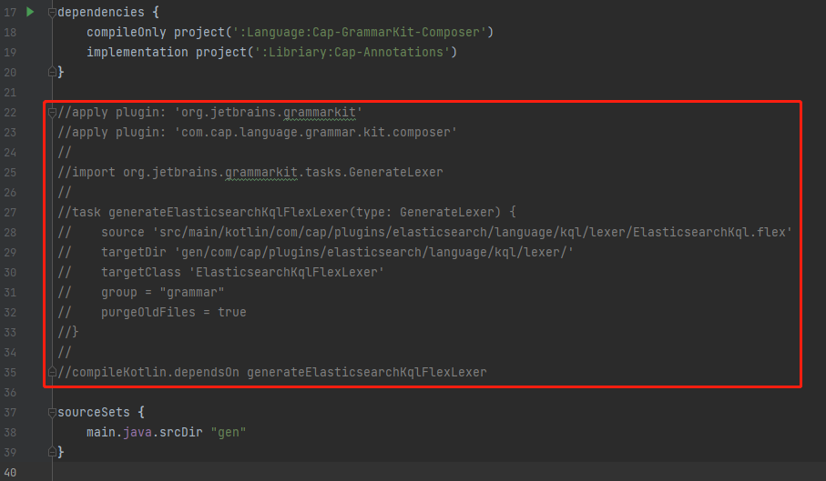
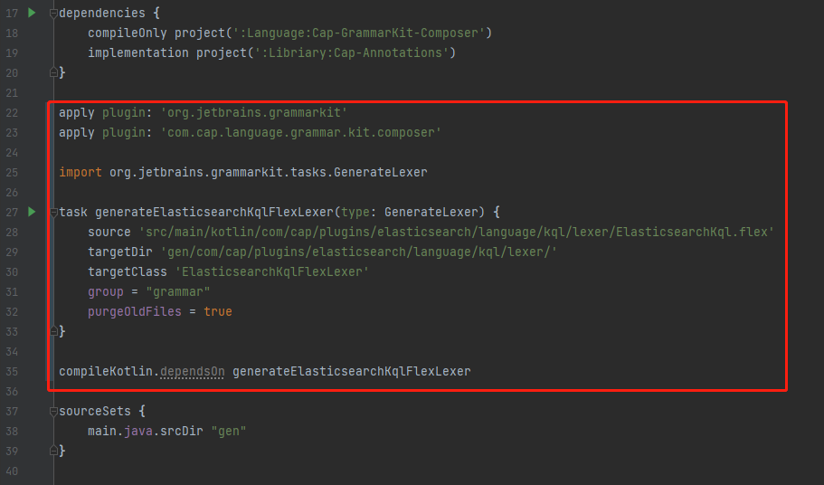
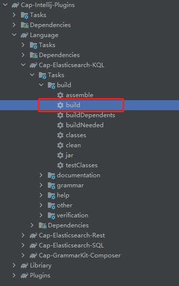
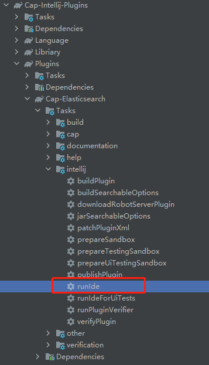
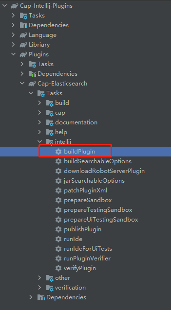
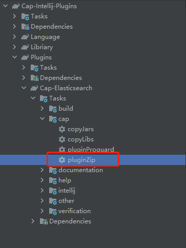

# 如何构建这个插件

## 克隆项目

## 导入开发环境

## 按顺序编译

> <font color="red">**重要：**</font>**需要完成以下三个模块的编译，才能正常的进行开发、调试及发布插件！！！**

1. 编译 `Cap-GrammarKit-Composer`

命令行编译
```
gradlew Language:Cap-GrammarKit-Composer:build
```

或者开发环境中编译



2. 编译 `Cap-Elasticsearch-KQL` and `Cap-Elasticsearch-SQL`

首先，取消文件`Language/Cap-Elasticsearch-KQL/build.gradle`和`Language/Cap-Elasticsearch-SQL/build.gradle`中的所有注释。





然后进行编译。

命令行编译
```
gradlew Language:Cap-Elasticsearch-KQL:build
gradlew Language:Cap-Elasticsearch-SQL:build
```

或者开发环境中编译



当编译完成，如果不对这两个模块的代码进行修改，那么可以重新注释掉原来注释的内容。

## 插件结构

```
Cap-Intellij-Plugins
|--Language                    自定义语言
|  |--Cap-Elasticsearch-KQL      KQL语言模块，主要模仿Kibana中的DevTools Console的功能
|  |--Cap-Elasticsearch-Rest     Rest请求相关的内容
|  |--Cap-Elasticsearch-SQL      SQL语言模块，主要是提供SQL语法定义及高亮显示等
|  `--Cap-GrammarKit-Composer    语法工具包，主要用来对自定义语言进行编译
|--Libriary                    类库
|  |--Cap-Annotations            注解模块，主要是提供了代码混淆相关的注解
|  `--Cap-Commons                公共类库模块，提供一些公共的类
`--Plugins                     插件
   `--Cap-Elasticsearch          Elasticsearch客户端插件
```

## 开发

完成上面的三个模块的编译后，可以根据需要对各个模块进行开发。

## 调试

> 在IDEA 2020环境运行，建议JDK版本1.8+  
> 在IDEA 2021环境运行，建议JDK版本11+

完成上面的三个模块的编译后，可以调试插件。

命令行调试

```
gradlew Plugins:Cap-Elasticsearch:runIde
```

在开发环境中调试



## 发布

如果需要发布插件，在完成自定义语言模块的编译后，执行

命令行

```
gradlew Plugins:Cap-Elasticsearch:buildPlugin
```

开发工具



如果需要对发布的插件进行代码混淆，则发布过程变为

命令行

```
gradlew Plugins:Cap-Elasticsearch:pluginZip
```

开发工具


